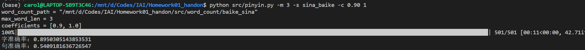

# Pinyin Input Method

> 陈鑫圣&emsp;计算机科学与技术系 计13&emsp;2021010760

***

This is a project for the course "Introduction to Artificial Intelligence" in Tsinghua University, 2023. The project is to implement a pinyin input method based on a bigram and trigram model.

Refer to the [report](report.pdf) for more details.

## 文件结构

```
.
├── README.md
├── data
│   ├── input.txt
│   ├── output.txt
│   └── std_output.txt
├── images
│   └── pinyin_usage_example.png
├── parameters
│   ├── sentence-acc_sina_2_refined.png
│   ├── sentence-acc_sina_2_rough.png
│   ├── sina_2_refined.txt
│   ├── sina_2_rough.txt
│   ├── word-acc_sina_2_refined.png
│   └── word-acc_sina_2_rough.png
├── raw_data
│   ├── 一二级汉字表.txt
│   └── 拼音汉字表.txt
├── report.md
└── src
    ├── __pycache__
    │   └── utils.cpython-39.pyc
    ├── data_preprocess.py
    ├── dictionary.json
    ├── pinyin.py
    ├── test_parameters.py
    ├── utils.py
    └── word_count
        ├── baike_sina
        │   ├── head_count_1.json
        │   ├── head_count_2.json
        │   ├── total_count_1.json
        │   ├── total_count_2.json
        │   └── total_count_3.json
        └── sina
            ├── head_count_1.json
            ├── head_count_2.json
            ├── total_count_1.json
            ├── total_count_2.json
            └── total_count_3.json

9 directories, 30 files
```
## 文件介绍

### `src/data_preprocess.py`

- 该文件进行语料库的数据预处理和词频表生成，以及拼音汉字表的数据预处理。
- 该文件支持命令行输入参数，包括训练集文件路径，模型选择等。在项目根目录下运行 `python src/data_preprocess.py -h` 可以查看帮助。
- 如果需要运行该文件，**需要在 `raw_data` 目录中放入相应的原始数据文件**。具体而言，下发的 `sina_news_gbk` 文件夹，以及百科问答语料库（https://cloud.tsinghua.edu.cn/d/df510cc2fba34aaf8ad9/）的 `baike2018qa` 文件夹需要置于 `raw_data` 下。

### `src/pinyin.py`

- 该文件是运行拼音输入法的文件，它从一个文件中读取拼音，并将结果写入另一个文件，同时输出字准确率和句准确率。
- 该文件支持命令行输入参数，包括输入文件、输出文件、标准结果文件、参数、训练集、所使用的模型等。在项目根目录下运行 `python src/pinyin.py -h` 可以查看帮助。

例如，在命令行中输入 `python src/pinyin.py -m 3 -s sina_baike -c 0.90 1` ，结果如下



### `src/utils.py`

- 该文件为其它代码文件提供有用的变量和函数。在拼音输入法的预处理、训练和使用中都不需要单独运行它。
- 该文件中，简单地定义了项目根路径以便于其它文件使用，并定义了一个函数装饰器用于计时。

### `src/test_parameters.py`

- 该文件是用于测试二元模型的最佳参数时的脚本。在拼音输入法的使用中并不需要用到。
- 在项目根目录下运行 `python src/test_parameters.py` 可以对参数 `x` 进行枚举测试，结果存放在 `parameters` 目录下。

### `src/word_count`

- 拼音输入法训练时生成的词频表。提交时已包含完整的词频表，可以直接运行 `scr/pinyin.py` 。

### `raw_data`

- 该目录下是原始数据文件，包括拼音汉字表、一二级汉字表的原始文件。以及两个训练数据集（新浪新闻和百科问答），**但在提交的版本中不包含这两个文件**。
  
### `data` 

- 该目录下包括拼音输入法的输入文件 `input.txt` ，转换结果文件 `output.txt` 以及标准结果文件 `std_output.txt` 。

### `report.pdf`

- 本实验的实验报告。